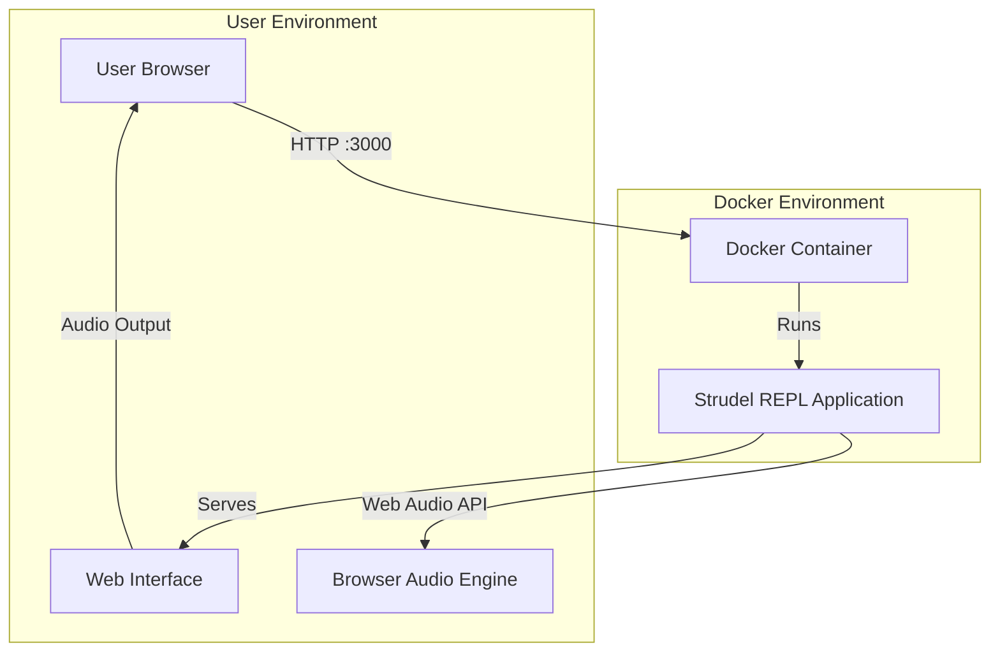

# Strudel REPL - Self-Hosted Docker Environment

A self-hosted Docker environment for running [Strudel](https://strudel.cc/) - a live coding environment for making music with code in the browser.

## 🎵 What is Strudel?

Strudel is a JavaScript-based live coding environment for creating music. It's inspired by TidalCycles and allows you to compose patterns, sequences, and musical structures using code.

## 🏗️ Architecture



## 📋 Prerequisites

- Docker (version 20.10 or later)
- Docker Compose (version 2.0 or later)
- Make (optional, for convenience commands)

### Verify Installation

```bash
docker --version
docker-compose --version
```

## 🚀 Quick Start

1. **Clone and start:**
   ```bash
   git clone <your-repo-url>
   cd local-strudel-infra
   make build && make up
   ```

2. **Access Strudel REPL:**
   Open [http://localhost:3000](http://localhost:3000) in your browser

3. **Start making music!**
   Try a simple pattern:
   ```javascript
   s("bd sd bd sd")
   ```

## 🛠️ Available Commands

Use the Makefile for convenient operations:

| Command | Description |
|---------|-------------|
| `make build` | Build the Docker image |
| `make up` | Start the Strudel REPL container |
| `make down` | Stop the container |
| `make restart` | Restart the container |
| `make logs` | View container logs (follow mode) |
| `make clean` | Remove container and clean up |
| `make shell` | Open a shell in the running container |
| `make status` | Show container status |
| `make help` | Display help message |

## 🔧 Configuration

### Port Configuration

Strudel runs on port `4321` inside the container, mapped to port `3000` on your host.
## 🧪 Verification

Check that everything is working:

```bash
make status    # Container should be running
make logs      # Should show Astro server ready
```

Then open [http://localhost:3000](http://localhost:3000) - you should see the Strudel REPL interface.

## 📚 Learn More

- [Strudel Documentation](https://strudel.cc/learn/)
- [Strudel Repository (Codeberg)](https://codeberg.org/uzu/strudel)
- [TidalCycles](https://tidalcycles.org/)


